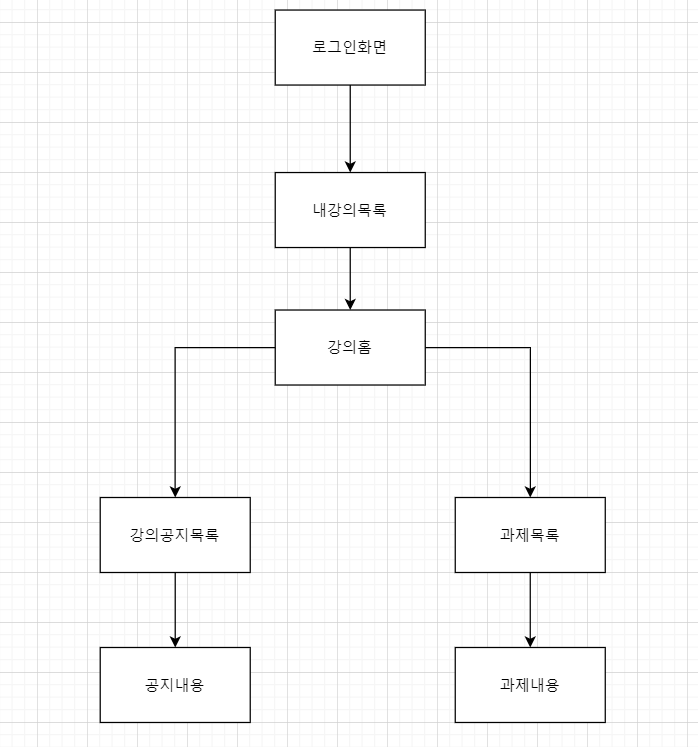
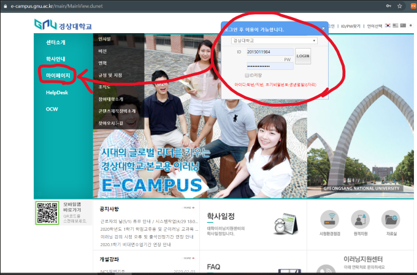
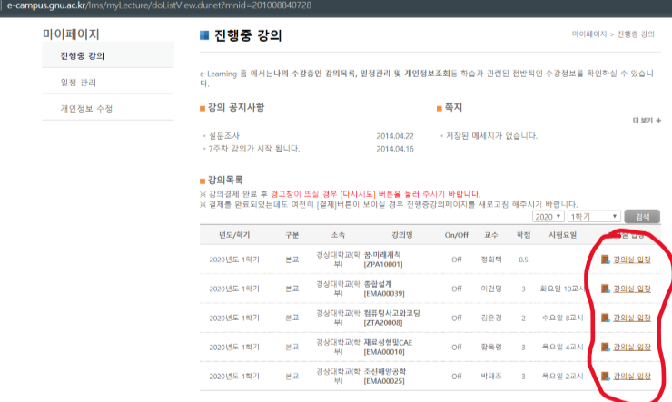
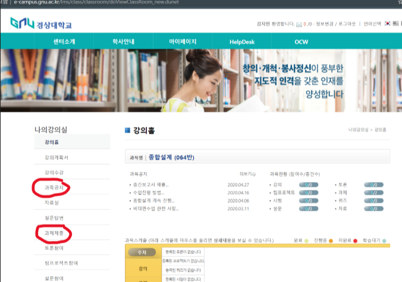
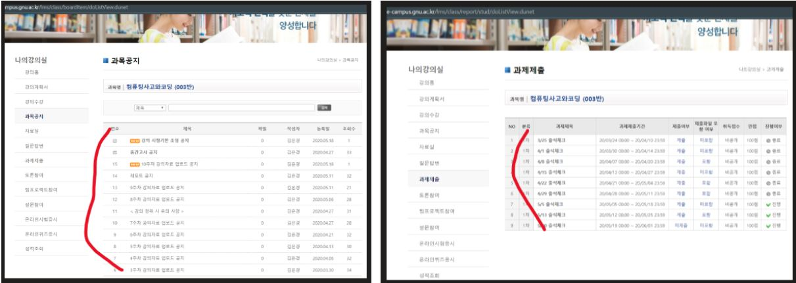
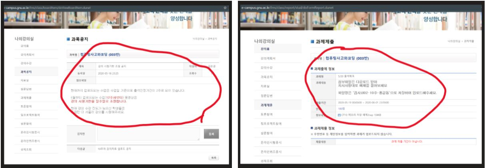
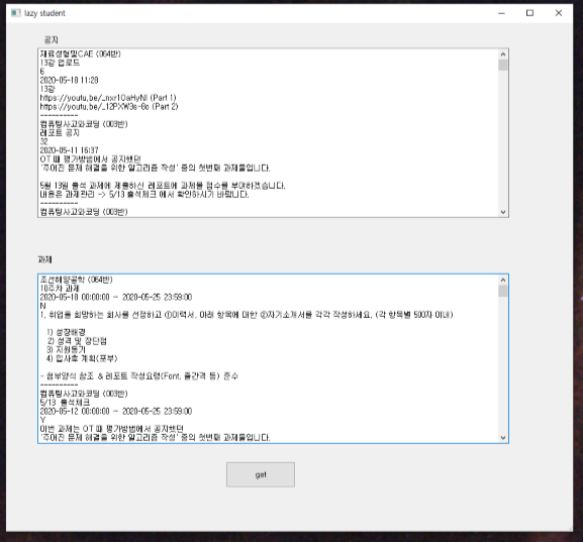

# Lazy-student

한국어 [https://9jimin.tistory.com/37](https://9jimin.tistory.com/37)

Because of corona virus, this semester is full online. the problem is each course has different update pattern. so hard to know all at once. And I just happen to learn about web scraping and thought.. using this method, I can make this thing a lot more easier.

## project process

> 05.09-05.12

Learn how to use selenium.
Auto login, searching my courses and find updated video and play.

It was amazing to see my code automatically interact with browser. and so much fun to learn like this new feature.

And I learned other things like python's virtual environment , PyQt5 for program's gui. but the problem is scraping with selenium is too slow.

> 05.13-05.16

Pause project. I felt a limit to my ability. so I decided to study basic python, software structure, crawling model. To do that, I read books and scraping tool's document.

> 05.17-05.18

Analyze target site. how login works and how to check authority. I spent lots of time analyze request header and cookies. because this site doesn't use URL to send request, but use post request with hidden form data. By doing this, I could learn a lot about the principles of network. And finally, display scrapped data on the gui program and make exe file to use easily.

## How to get data

It requires long process to get the target data. first login to get session. and go to my courses page. then enter on course overview page. and then go to the notice or homework page. and click one element then finally can get the target data. the process have to be repeated all course and all notice and homework.

This process must be repeated in all my course's notices and homeworks.

1. Login and get sessions. move to my courses page

2. enter course detail page

3. go to notice or homework page

4. notice and homework list. enter one.

5. finally can see the target data.

6. after repeated all. then display data to the browser.

## What I learned from this project

I learned so much about session, cookies, network(req-res) principle. And that makes me to learn more about other related fields. for example, network security.. machine learning.. software architecture.. and a lot more! So, the biggest thing we got from this project is the desire to learn new skills.
